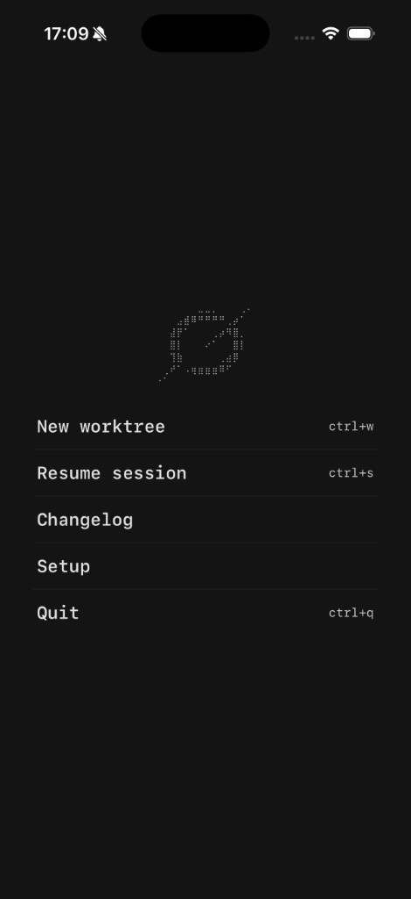

# grok-ios

iOS client for [Grok Build](https://github.com/xai-org/grok-build).

The phone is the pager UI. Your Mac runs the official agent via `grok agent serve`. They talk ACP over WebSocket.

**Author:** Pedro Shakour  
**License:** Apache-2.0



## Requirements

- macOS with [Grok CLI](https://x.ai/cli) (`grok`)
- xAI API key
- Xcode 16+ (Simulator or device)
- iOS 17+

## Clone

```bash
git clone --recurse-submodules https://github.com/Pedroshakoor/grok-build-ios.git
cd grok-build-ios
```

If you already cloned without submodules:

```bash
git submodule update --init --recursive
```

## Quick start

### 1. Start the agent on your Mac

```bash
export XAI_API_KEY=xai-...
lsof -ti tcp:2419 | xargs kill -9 2>/dev/null
grok agent serve
```

The CLI prints a **Secret**. Leave this terminal open.

### 2. Run the iOS app

Open `ios/GrokApp/GrokApp.xcodeproj` in Xcode → run on Simulator or device.

Or:

```bash
./scripts/run-simulator-demo.sh
```

### 3. Connect

In the app: **Setup** → paste the Secret → **connect** → **continue** → **New worktree**.

| Client | Host | Port |
|--------|------|------|
| Simulator | `127.0.0.1` | `2419` |
| Physical iPhone (same Wi‑Fi) | your Mac LAN IP | `2419` |

## Architecture

```
iOS (SwiftUI)  ──ACP / JSON-RPC over WebSocket──►  grok agent serve (Mac)
```

Optional legacy LAN bridge (TLS + Bonjour) lives under `companion/` for experiments. The default path is official `grok agent serve`.

## Repo layout

| Path | Purpose |
|------|---------|
| `ios/GrokApp/` | SwiftUI app |
| `companion/` | Legacy ACP TCP/TLS bridge |
| `shared/` | Themes + slash catalog from upstream |
| `upstream-grok-build/` | Pinned [xai-org/grok-build](https://github.com/xai-org/grok-build) submodule |
| `scripts/` | Demo + smoke helpers |
| `docs/` | Screenshots |

## Development

```bash
bash scripts/check-source-rev.sh
bash scripts/smoketest.sh
```

Stub ACP (CI / no API key):

```bash
./scripts/run-simulator-stub-demo.sh
```

## Notes

- Not on the App Store — open-source / sideload / Simulator only.
- Agent runtime stays on the Mac; the phone is a remote pager.
- Themes and slash names are taken from upstream Grok Build.

## License

Apache-2.0. See `LICENSE`, `NOTICE`, and `THIRD-PARTY-NOTICES`.
